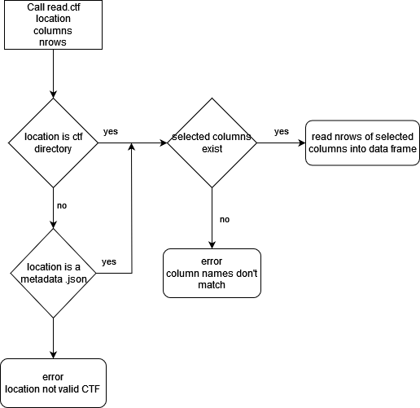
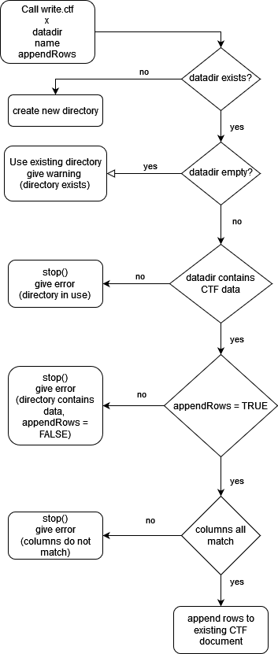

## Design Notes

It's not sufficient to return a data frame from `read.ctf`, because that will ignore all the description metadata that existed in the JSON file, for example, the description of the columns.
We need a way to preserve and represent this metadata in R.

Here's a couple options for what `read.ctf` could return:

1. list with the data frame and the metadata objects
2. data frame with metadata as an attribute
3. data frame with metadata in a comment- seems like a bad idea to put metadata back into a string.

Ideally, we could pick the functionality of describing data up from an existing package.
Based on a few Google searchs like this [StackOverflow post](https://stackoverflow.com/questions/11348320/is-there-a-standard-way-to-document-data-frames?noredirect=1&lq=1) it looks like the "Hmisc" package may have this functionality.
The [labelVector package](https://cran.r-project.org/package=labelVector) also seems like the right idea.
Unfortunately, the `get`, `set` methods aren't idiomatic R, and the package isn't on Github.

Short term, storing the metadata in an attribute seems like the best design.
It's a data frame, so it won't break code if we switch from a list to a data frame in the future.
Long term, it makes more sense to create and depend on a more focused package for labeled data that's tied to CSVW.
This is close to the original xarray approach of creating a Python object in memory that mirrors the netCDF object on disk.

It's simpler not to append `.txt` to the end of the column names, because a column name might end with `.txt`, and that would be confusing.

---
outline:

title
important people: authors/reviewers/ect
date last updated: Latex present time when knit
software:
	api: user facing functions
		look up how to document function in R and then copy that style
	backend or helper or private functions: less detailed
	
	How to describe a single function:
		Name
		Function signature (Probably some specific way to document this)
		Brief written explanation
		Data Flow Diagram (use draw.io) (https://stackoverflow.com/questions/14494747/how-to-add-images-to-readme-md-on-github)
		Description of data flow diagram.

---

## CTF Software Design Document
\
Authors: Julian, snaderi, Van, Alisa, Harry, Dylan, Clark \
Date last updated: 7/14/2024 \
Who updated: Harry

## Software Overview

Column Text Format, or `CTF` is a data format which functions as a column store, while simultaneously being stored as plain text for ease of use with Unix terminal commands. `CTF` is designed with ease of use and simplicity in mind. Data analysis is the use case. Data larger than memory is supported. Conversion to and from common data formats is supported.

#### What `CTF` is not: 

`CTF` differs from traditional column store technology in that it is not compressed. Compression benefits columnar datasets in a few key ways. 
- Column stores are more compressible than row stores and thus achieve a smaller disk usage footprint. This is achieved by specialized compression algorithms which take into account the type of data, i.e. `string` or `integer`, and which benefit from repeats in the data. 
- It is possible to modify a compressed column store without the costly steps of decompressing and recompressing it.

This means that CTF is not a reasonable format for long term data storage. Nor is it a format for transactional data, where rows are being added or removed frequently. It is an intermediary form of data, for the purpose of data analysis.

TODO: fixed width format? What else should be mentioned? Is this accurate?

## API

This is where user facing functions are documented. 

#### read.ctf
read.ctf = function(location, columns, nrows)

#### Parameters

`location` location of the CTF data, either a file path to a CTF metadata JSON file, or a directory containing a single CTF metadata JSON file. \
`columns` names or numbers of the columns to read. If missing, then read in all columns. \
`nrows` integer, the maximum number of rows to read in. If missing, then read in all rows. 

#### Returns
`data frame`

#### Brief Description

Read external CTF data into the corresponding R data frame.

#### Data flow diagram

#### Brief overfiew of diagram

This diagram shows the logical decision tree for `read.ctf`.
[Edit](https://app.diagrams.net/?tags=%7B%7D&lightbox=1&highlight=0000ff&edit=_blank&layers=1&nav=1&title=read.ctf.drawio#R%3Cmxfile%3E%3Cdiagram%20name%3D%22Page-1%22%20id%3D%22zPxkarRjumX2kYX-f9Hx%22%3E7VlNU9swEP01mZ7IWP5IzJUQaGfaTju0BY7CVmyBrQ2yTJz%2B%2BkqxHEe2CaYTEhg4RVqtpPW%2B3aeVMnAmaXHO8Tz%2BBiFJBrYVFgPndGDbyHVc%2BaMky1Iy9u1SEHEaaqVacEH%2FEi20tDSnIckMRQGQCDo3hQEwRgJhyDDnsDDVZpCYu85xRFqCiwAnbeklDUVcSn3PquWfCY3iamdk6ZEbHNxFHHKm92PASDmS4moZrZrFOITFhsiZDpwJBxBlKy0mJFFurTxWzjt7ZHRtMidM9JmQ3ftTfJ3%2B9O7O7T%2Fz7%2FdHX35fHWncMrGsXEFC6RndBS5iiIDhZFpLT1afS9SqluzVOl8B5lKIpPCWCLHUMONcgBTFIk30qDSYL6%2FU%2FKFXda%2F1cqvOaWH0lrpX2qoMfNQFWpRBzgOy5bt1eArMIyK26DlroGTsE0iJtEfO4yTBgj6YdmAdhNFar0ZDNjQgzwBHG%2FmAk1zvNLBHiTT3JKQPshmp5gSvFuIEh8NAzCoNueGGUse8BAL5CcB6TwggyVOW9dZnq7TU8hve1GzOb4ShGWSLmApyMccrTBeSg8yA0n4iXJBie2i0oawmeOWMpUlMi5oNUJXI8QYTjKwXwn7Uwp7BO81Vp2euelsBPrKGyLWPO1Hunc569R9A5UfUKjCbZdK0JuZrI%2F4%2FDPxWGCzlOXnQODCioA6K1xMH46fiYOSOkRkH3muPA6cVBzV%2FWzRTpZHifiukXNZHoAnIINQY0ps82wuZVkxZudfpYFPUwaZr4c7p9Pgjj0ye3EUe%2BZ4%2F2mkeFZ0TXi6rvCezCqtKnggcYqGaw9tMjR0yteyhWanYxx3JZXn7TC6EPooVI2l6JBeyumF%2BMycSah9J75dSe6Nuv3HUxy3QM5LIikPip15n9A3RIgXNxGF5snmhO3wNUi28%2FT5POAf%2BzEu5XJThVGWfFQL7JMrnpyDewe0b7Qkts2K0%2FUPfv1H78UU9sShPl%2B8aFqh6uzP6ZTKCgqKsGWZcQnNwDzt%2BIx%2B8cVVIbPrY7fCx572Uj73XVCSg%2FR0XyO15XjzypLGf58fKyl3y1UZ9zUCUi1OVPZNfZ2%2BGrRpk5XodZOXshqxkt%2F6HoDzE639gnOk%2F%3C%2Fdiagram%3E%3C%2Fmxfile%3E)

#### write.ctf
write.ctf = function(x, datadir = name, name = deparse(substitute(x)), appendRows = FALSE, ...)

#### Parameters

`x` data frame to write \
`datadir` directory to write the metadata and CTF columns \
`name` table name \
`appendRows` logical. If TRUE, the output is appended to the file \
`...` further arguments to iotools {write.table.raw}

#### Returns
`NULL`, used for its side effect \

#### Brief Description

Save a data frame using Column Text Format.

#### Data flow diagram

This diagram shows the logical decision tree for `write.ctf`.
[Edit](https://app.diagrams.net/?tags=%7B%7D&lightbox=1&highlight=0000ff&edit=_blank&layers=1&nav=1&title=Untitled%20Diagram.drawio.png#R%3Cmxfile%3E%3Cdiagram%20id%3D%22C5RBs43oDa-KdzZeNtuy%22%20name%3D%22Page-1%22%3E7Vtbd9o4EP41nNM%2BJMfGN3gMBJLdTXp2G7JJnnqELYw3tsXaIkB%2BfSUs%2BSIZsAkmpM1La4nxWNJ8M%2FPN2Glp%2FWB5FYHZ9BY50G%2B1FWfZ0i5b7baqazr5j86skhmr004m3MhzmFA2cee9QjapsNm558C4IIgR8rE3K07aKAyhjQtzIIrQoig2QX7xqTPgQmnizga%2BPPvgOXiazHbaVjZ%2FDT13yp%2Bsmt3klwBwYbaTeAoctMhNaYOW1o8QwslVsOxDnx4eP5eHP1YP%2Fs2zefXnP%2FH%2F4L731%2Bjbv2eJsmGdW9ItRDDEh1XNbPkC%2FDk7L7ZXvOIHGKF56ECqRGlpvSkOfHKpksv%2FIMYrZnAwx4hMoQhPkYtC4N8gNGNyExRiJqbSMQydC2pYMh77yH5Opoae77NnkBGT75BRjCP0nNqOKkgNQYV9MIZ%2BD9jP7nqhfeSjiPwUohBSVQ4BA9tLtrhBNksehqPVI1V2bvDhU7oQMrhcFkYrNqpoE2a7GM0jG26R05hrgMiF2%2FSZiRzdVw7fzOJXEAWQLJIIRNAH2HspOgFgvuSmcuxWYg%2BwygnMkBfiOKf5bzpBBFhY0Lh3s6BgFqBHLhKFfJRbWTa1hmcNqGolUDV9clY9x3shly697IO1okXkYXhu4wkXIU%2FMSZXcuKws6QAMHC%2BqLB%2BCAFYWBrMZQf93GvXYj%2BNIFBeVbPRX6iuLKTmJuxlYg29BQnzRh%2FO%2BSYzdc30QxwzhOxyvngO8wAjD5VbIcmwVocWj7yIL3iqfm%2BYCd0fZjPEcMOvjTpdw9wTj3y1KHjjamRWjHQ8zO8Mdw86Zcq5bBfhwDfXiYRbwuAiaTGKy1ByY6sZMXdWLK2sfIWgaEni%2FIQm7u83%2FsdG99PAjV0uun7JkT0ZZeqeDhrJ7VbxbteFuWAKszk4H8WpHOT7iTQnxacJWiIljsmBtKIfvKQrG83h3wizgjqJ6CALPpxu8hv4LxJ4NStIq8D03JAObwAlG5YAmj%2FRCl4zMbDRaOxBJQc2lW87duJE6JflWOWa%2BtSQD2hEEmHAoJYQLWol6ESkUEXvUr0R9UmLDHaZbkfzoTRmjUyV%2FfOzscCIVYj43PP547T6OFuDH5BbejtxbjJ6uuVwdKtRtG8fKDXKJKMSVlIlxHUnSZHdtU6QIirqCouTkJEW1a1rxOeoRslVX8q%2By4uIXJ2gHJlscaLuri3ZFl2q8ljgUnPgKy9lPMMOrT%2FJT6DWYQk1mvTf74Zjc3ua6jyGns%2FTYCpyoYqfJpQAmGwVRuFZhgoBaOxzHsy29JknNl9yTGb%2F%2B%2Btu2rgxD4G%2BWIcNJK4GTdQA4lZMGmcCVGHGdcypZqG4mKs01JTkpZ1dervPr6uW6EMf3SynbuNdOjtbZRcnaAh%2FrnlBGKd0RX8xhO0j7wOJNLPz9oZGYehs2FLGV0z4lvlGODjlbbUDHDWWARYtKvIAGWkIh%2FAv2Q%2BA5TgIeGHuvYLzWR23KqDxRbvRaxmVqZSlSp6%2BV2c2t9Ezz9t8C%2FI32Us5VXRE7b28zF2%2FIqOUxonlryq6%2B7fUXPVoMvHBj6pBfzo2GlKoQBVX5QFViutH81dx8c3NMEzyyrCFTltBT0njwjF7pNWiM0ezL17pcEJKCL9qP%2BWVYYPbt780o869AlfUOleHFzd3gSLSyKSipAjc0tBJuWNbbaw5Kcqc1OXsaw5LjJ0m4UGYwD0b2PICs23JyB23qxYO2lIpNVLMxEi5nyUN0eY5Iok6Rk3eqEi99F%2FFS9Xa3ABlVO0gm14VPGQyxBXqgzqUhvGfTu4aA2VznMrt7VbqtBumFnLo%2BS4l9EK3tArTU9jfehufmsVGpTVHCDEbf7wd0sDc1eG%2BGKb4mSWNGPlvpegkt0BpLV%2FJHI5%2Fp6u19Ar2id1u7vNssAGa%2FJkHdFGMJL8fMbZ9yHDNwqPL3Hp9JZS%2FcqTuBZ2hWEXtnb%2B1Q8TK7K6BLfL2ygSgdFWjyd6A28ufBuuZNvjoOALanp5diDJGGVn3J1Vzlqcql53t1MTIjOrTYDRHmlvzgDQdNL%2FauTOPd62D5a4dT6F15IflnHsMPbm%2BhCEyJZQPmJsPsz56SAJv98Zg2%2BAk%3D%3C%2Fdiagram%3E%3C%2Fmxfile%3E) 

## Internal Functions

This is where helper functions, or private functions are documented. Less detailed than user facing.

#### map_types TODO:check this
map_types = function(x, to)

#### Parameters

`x` What we want to convert, either `meta' or `type_iotools` \
`to` 

#### Returns
`x` but mapped to an alternate type

#### Brief Description

This function is a helper function for read.ctf. It performs a mapping between types within the context of iotools and our metadata. \
If `to` is `type_iotools`, then `x` is assumed to be `meta` and converted to `type_iotools`. \
If `to` is `meta`, then `x` is assumed to be `type_iotools` and converted to `meta`. \
This allows us to context swap our meta data to function with iotools.

#### read_one_col TODO:check this
read_one_col = function(con, ...)

#### Parameters

`con` connection, where we are reading our single column of data from \
`...` additional arguments for mstrsplit()

#### Returns
`single row` as raw binary data

#### Brief Description

This function is a helper function for read.ctf. It performs a mapping between types within the context of iotools and our metadata. \
If `to` is `type_iotools`, then `x` is assumed to be `meta` and converted to `type_iotools`. \
If `to` is `meta`, then `x` is assumed to be `type_iotools` and converted to `meta`. \
This allows us to context swap our meta data to function with iotools.

#### Data flow diagram (if applicable)

#### factor_to_character TODO: check this
factor_to_character = function(x)

#### Parameters

#### Returns

#### Brief Description

## File format specification

TODO: explain what it is, and the motivations behind certain implementation details or design choices.

#### Metadata

TODO: current specification for metadata file, including example

#### Text file

TODO: current specification for column text file

	
	
	
	
	
	
	
	
	
	
	
	
	
	
	
	
	
	
	
	
	
	
	
	
	
	
	
	
	
	
	
	
	
	
	
	
	
	
	
	
	
	