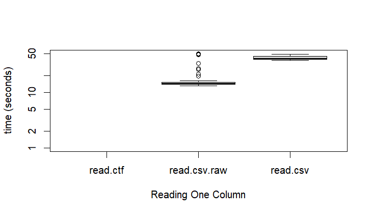
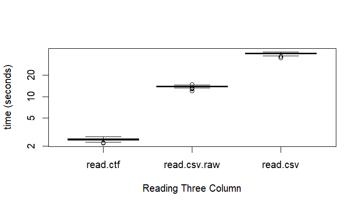
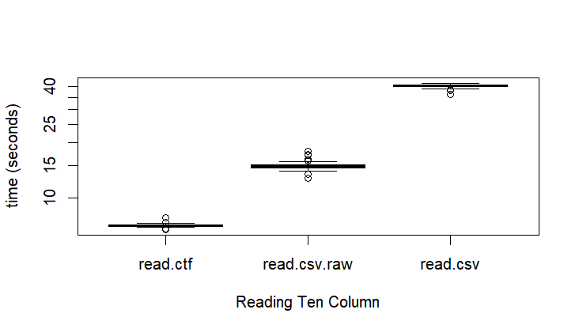
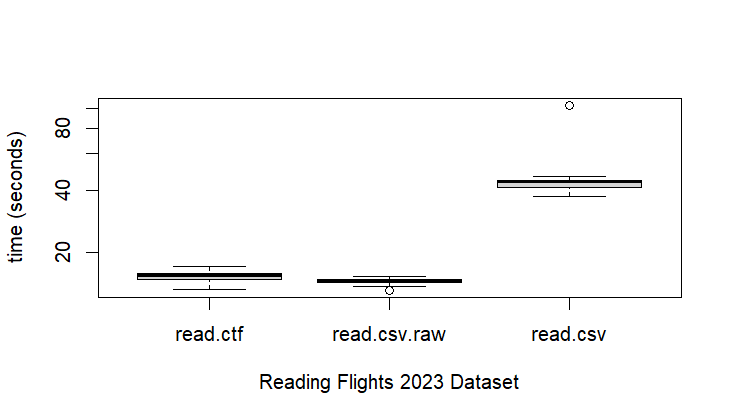

Microbenchmarking CTF against CSV Reading Columns
================
Van Nguyen
2024-07-08

## CTF

CTF (Column Text Format) stores the columns of tabular data in plain
text, combining the simplicity of text with the performance of a column
store.This should allow for faster reads for specific columns over the
built in read.csv and read.csv.raw from `{iotools}` package.

For this microbenchmark, we’ll be using the `{microbenchmark}` package
for R, timing and running reads 100 times for `read.ctf`, `read.csv`,
`read.csv.raw`. The data set used is a flights data set for all months
in 2023 from the Bureau of Transportation Statistics. It is 6.8 million
rows by 22 column dataset.

## Comparing read speed for 1, 3 and 10 columns

<!-- -->

For each read, there is a boxplot representing the 100 reads done
through `{microbenchmark}` . While `read.csv.raw` takes about 16 seconds
on average and `read.csv` takes around 42 seconds on average to complete
their reads, `read.ctf` does not even show on the graph taking 0.4
seconds on average to finish its. It is an over 100 times faster than
`read.csv` and 40 times than `read.csv.raw`.

<!-- -->

<!-- -->

Even when reading more columns, on average, `read.ctf` is much faster
than `read.csv` and `read.csv.raw`. While more column will result in a longer
read time for `read.ctf`, for the other two, despite reading more
columns, takes a similar amount of time to read the columns no matter
how many columns is selected, around 15 seconds for `read.csv.raw` and
around 40 seconds for `read.csv`. This is due to both requiring a read 
of the entire dataset then filtering to the selected columns.
`read.ctf` is able to sidestep reading the entire dataset and only 
read the selected column. Since each column is stored as its own file in CTF, 
there is no need to read the entire dataset and filter to the selected 
columns as `read.ctf` directly reads the selected columns.

## Comparing read speed for the entire dataset
<!-- -->

When reading in the entire dataset, `read.ctf` is slightly slower than
`read.csv.raw` taking 15.3 seconds on average to read the entire dataset
while `read.csv.raw` took 14.5 seconds on average. Due to an outlier,
`read.csv` took about 44 seconds on average to read but without it the
average read time would be closer to 40 seconds. 
